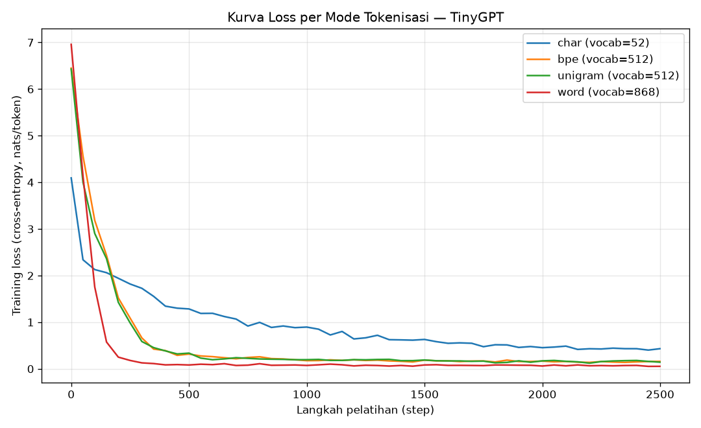
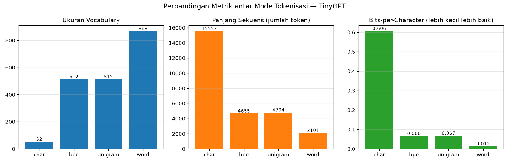

# Laporan Analisis — TinyGPT & Perbandingan Mode Tokenisasi

## 1. Ringkasan Eksperimen

- **Corpus**: Bahasa Indonesia, tema Data Mining/Machine Learning (`corpus.txt`) — **2101 kata**, **15577 karakter**.
- **Arsitektur (konstan semua mode)**: block_size=32, embedding_dim=64, n_heads=4, n_layers=3, lr=0.003, epochs=2500, batch_size=32.
- **Mode tokenisasi dibandingkan**: `char`, `bpe`, `unigram`, `word`.
- **Catatan adil**: hanya tokenizer yang divariasikan; arsitektur model identik. Karena cross-entropy loss bergantung pada `vocab_size`, metrik pembanding utama adalah **bits-per-character (BPC)** yang dinormalisasi terhadap jumlah karakter corpus (denominator sama untuk semua mode).

## 2. Tabel Hasil

| Mode | Vocab | Token | Token/Kata | Loss (nats/tok) | Perplexity | **BPC** | Waktu (s) |
|------|------:|------:|-----------:|----------------:|-----------:|--------:|----------:|
| `char` | 52 | 15553 | 7.40 | 0.4209 | 1.52 | **0.6062** | 22.9 |
| `bpe` | 512 | 4655 | 2.22 | 0.1540 | 1.17 | **0.0662** | 24.7 |
| `unigram` | 512 | 4794 | 2.28 | 0.1519 | 1.16 | **0.0671** | 24.8 |
| `word` | 868 | 2101 | 1.00 | 0.0644 | 1.07 | **0.0124** | 26.3 |





## 3. Contoh Teks Hasil Generasi

Seed/prompt awal: `data mining`

**Mode `char`:**

```
data mining dapat diproses oleh model. Pemilihan merixi huruHuve pom data yang tidak bia, biar belam si dari mencoba bersan data, transformasi derb agena membagi pekerja alat tidak seimbang, satu tidak Cik, komputer adalah salah memaksimalkan algoritma dalam da
```

**Mode `bpe`:**

```
data mining adalah disiplin ilmu yang menggabungkan statistika, basis data, dan kecerdasan buatan. Tujuannya adalah mengubah data menjadi pengetahuan yang berguna bagi pengambilan keputusan. Proses ini mengubah bentuk mengolah itu, dan cepat dilatih, data menunjukkan jumlah prediksi benar dan ciri ke kelabel. Nilai alami memungan adang yang hinggi menjadi d
```

**Mode `unigram`:**

```
data mining. Sistem mengenali pola transaksi yang tidak wajar dan menandainya sebagai mencurigakan. Bidang kesehatan menggunakan data mining untuk membantu diagnosis penyakit dari data pasien. Pemasaran menggunakan data mining untuk mengelompokkan pelanggan dan menyusun strategi yang tepat. Pemrosesan bahasa alami atau natural language processing
```

**Mode `word`:**

```
data mining adalah menemukan pola, hubungan, dan informasi tersembunyi yang sebelumnya tidak diketahui. Data mining sering disebut juga sebagai penambangan data karena prosesnya mirip dengan menggali emas dari tumpukan tanah. Dalam dunia modern, data dihasilkan setiap detik dari berbagai sumber seperti media sosial, transaksi belanja, sensor perangkat, dan catatan kesehatan. Tanpa proses yang tepat, data dalam jumlah
```

## 4. Analisis Performa

### 4.1 Trade-off granularitas tokenisasi

- **`char` (karakter)** — vocab paling kecil dan **tidak pernah** menemui token tak dikenal (no-OOV), tetapi **sekuens paling panjang** (token/kata ≈ 7.40). Dengan block_size tetap, konteks efektif (dalam kata) menjadi paling pendek sehingga model sulit menangkap makna antar-kata.
- **`word` (kata)** — **sekuens paling pendek** dan konteks per-kata paling panjang, tetapi **vocab paling besar** dan rawan **OOV/`<unk>`** untuk kata langka. Pada corpus kecil ini banyak kata hanya muncul sekali sehingga sulit dipelajari dengan baik.
- **`bpe` & `unigram` (subkata)** — kompromi di tengah: memecah kata menjadi potongan yang sering muncul, menyeimbangkan ukuran vocab dan panjang sekuens, serta menekan OOV. Ini alasan tokenisasi subkata menjadi standar pada model bahasa modern.

### 4.2 Mengapa loss mentah tidak bisa dibandingkan langsung

Cross-entropy/perplexity dihitung **per token**, sedangkan satu token bermakna sangat berbeda antar mode (satu karakter vs satu kata utuh). Memprediksi 1 kata berikutnya menanggung informasi jauh lebih banyak daripada memprediksi 1 karakter berikutnya, jadi nilai loss per-token TIDAK setara. Karena itu kita menormalkan ke **BPC** (bit untuk meng-encode tiap karakter corpus), sehingga semua mode diukur pada satuan yang sama dan adil.

### 4.3 Temuan penting: BPC terendah = MEMORISASI, bukan otomatis 'terbaik'

- Secara angka, BPC terendah dipegang **`word`** (BPC = **0.0124**, perplexity = **1.07**).
- **Namun** perplexity yang mendekati 1.0 adalah tanda kuat **overfitting / memorisasi**: pada corpus sekecil ini model cukup *menghafal* urutan token, bukan benar-benar 'memahami' bahasa. Buktinya, teks hasil generasi mode `word` di Bagian 3 hampir **identik kata-per-kata** dengan isi `corpus.txt` — model hanya mengulang corpus.
- Mode yang menunjukkan gejala memorisasi (perplexity < 1.3): `bpe` (ppl=1.17), `unigram` (ppl=1.16), `word` (ppl=1.07). Semakin sedikit token (mode `word` → 1 token/kata, sekuens terpendek), semakin mudah dihafal sehingga BPC-nya paling rendah secara artifisial.

### 4.4 Kesimpulan & rekomendasi

- **Efisiensi tokenisasi terbaik**: `bpe`/`unigram` — token/kata ≈ 2.2–2.3, vocab moderat (512), tanpa OOV. Inilah kompromi yang dipakai model bahasa modern dan paling masuk akal untuk penggunaan nyata.
- **Kualitas generasi praktis terbaik**: `bpe`/`unigram` menghasilkan teks yang koheren TAPI masih bervariasi (tidak sekadar menyalin corpus), sedangkan `word` koheren karena menghafal, dan `char` (BPC=0.6062, perplexity=1.52) paling sulit — banyak kata 'mengada-ada' karena harus belajar mengeja dari nol dengan konteks efektif paling pendek.
- **Pelajaran kunci**: *loss/BPC terendah tidak selalu berarti model terbaik*. Pada dataset kecil, metrik rendah bisa berasal dari memorisasi. Kualitas perlu dinilai juga dari generalisasi (variasi & kebaruan teks), bukan angka loss saja.
- **Saran perbaikan**: perbesar corpus (puluhan ribu kata), pisahkan data latih/validasi untuk mendeteksi overfitting, naikkan block_size/embedding_dim, dan tambah epoch — terutama menguntungkan mode `char` yang butuh konteks lebih panjang.
